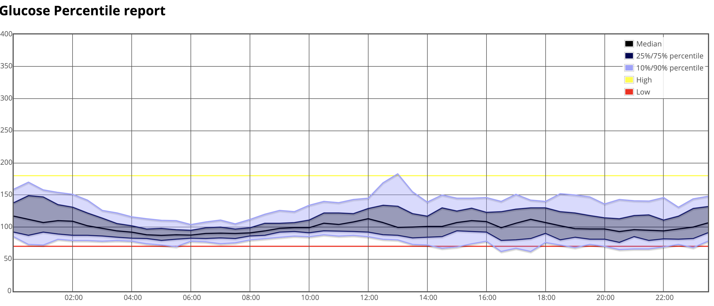

# Nightscout {: translate="no" }

[Nightscout](https://nightscout.github.io/){: target="_blank" } (NS) is a cornerstone of the DIY type 1 community. It is an excellent tool to remotely view Loop&#39;s actions and access insulin and blood glucose data. It allows for easy remote monitoring of *Loop* activities, troubleshooting of *Loop* errors, history of CGM, carbs, boluses, & temporary basal rates, and reports to analyze data trends and patterns. There is a *Nightscout* app in your iPhone App Store, or you can use a web browser to view the data.  [Setting up Nightscout for Loop](https://loopkit.github.io/loopdocs/nightscout/new_user/){: target="_blank" } is low-cost and fairly quick. Once set up, the site can be accessed by anyone that you share your unique *Nightscout* URL with.

## Nightscout Display
*Nightscout* is highly recommended for *Loop* users, especially those using *Loop* as caregivers. *Nightscout* displays are often the easiest way to troubleshoot *Loop* settings if you are having problems and seeking input from others.  Below is some discussion about the general *Nightscout* display, as well as some Loop-specific display information.

{width="700"}
{align="center"}

### Blood Glucose

Your blood glucose readings from your CGM are shown in green, yellow, or red in the main graph area of NS.  You can adjust your high and low blood glucose targets in NS (when NS alerts will start for high/low BGs), but those will not affect your *Loop* performance. *Loop* only uses the blood glucose targets given in the *Loop* app settings. The main screen displays the time duration you have selected (in the example above, 12 hours of BG history). The very bottom of the screen shows the last 48 hours of blood glucose trends. You can scan backward by dragging the bottom timeline to the left if you want to review specific *Loop* actions or data in the last two days.

### Carbohydrates

Carbohydrates are automatically uploaded to NS by the *Loop* app (when configured).  The amount of carbohydrates on board (active carbs or `COB`) can be seen by clicking the *Loop* pill.  The size of a white carbohydrate dot on the graph is proportional to the amount of carbohydrates entered...bigger meals get bigger dots. *Loop* does not read carbohydrates from NS (nor from the pump's bolus wizard) for use in looping calculations. *Loop* only uploads carbohydrates to NS that have been entered in the *Loop* app and recorded to *HealthKit*.

### Boluses

Insulin boluses are also automatically uploaded to NS by the *Loop* app. The bolus is shown as a filled-in blue lower half of the dot, and the specific amount of the bolus is also shown. There may be a slight delay between when the carbohydrates for a meal are uploaded to NS to when the meal bolus appears. This is because depending on the pump model and size of the bolus, the bolus may take a few minutes to actually be given and then Loop has to perform a pump read to verify the insulin delivery (i.e., the bolus was given). As shown in the example above, the meal carbohydrates have been uploaded, but the bolus delivery is still in progress. Insulin on board (active insulin or `IOB`) is also shown in the *Loop* pill.

### Temporary Basal Rates

Within your [NS profile](https://nightscout.github.io/nightscout/profile_editor/){: target="_blank" } , you can see in the scheduled basal rates from your *Loop* settings. Your *Loop* Therapy Settings profile is stored in your Nightscout site as the Default profile. Nightscout allows the user to have named profiles, but when used with Loop, the current profile is always called "Default" and it is uploaded from the *Loop* app. Fun Fact: your saved Override Presets are uploaded and saved in your Nighscout database and can be downloaded if you later need to start over with a brand-new *Loop* app. Refer to [LoopDocs: Onboarding](https://loopkit.github.io/loopdocs/loop-3/onboarding/#connect-loop-to-nightscout){: target="_blank" }.

The dashed blue line represents the scheduled basal profile (as entered in your NS profile). The solid blue lines indicate the actual basal amounts set for a given time...so as *Loop* sets temporary basal rates higher or lower than your scheduled basal rate, the solid blue line will jump above or below your dashed blue line. There can be a slight delay (up to 2-5 minutes) in the rendering of basal changes on the blue lines, so if you want the accurate current basal rate, you should check the *Loop* pill.

### Predicted Blood Glucose

The purple line to the right of the blood glucose readings is Loop&#39;s forecasted blood glucose curve.  Watching the behavior of that purple line can help you understand why *Loop* is making decisions regarding high or low temporary basal rates. You can read more on that topic in the [Algorithm](https://loopkit.github.io/loopdocs/operation/algorithm/temp-basal){: target="_blank" } section of *LoopDocs*.

### L&#8203;oop pill

The *Loop* pill is the little display box that when hovered over or clicked, will provide additional information about recent *Loop* activities and status. The information included is the last time *Loop* ran, the temporary basal rate set, `IOB`, and `COB`. Looking at the *Loop* pill is a quick method for assessing if your *Loop* is currently active, as well.  The small symbols to the right of the word `Loop` have a specific meaning. The small horizontal lightning bolt, shown in this example, is an active loop that recently enacted a temporary basal rate.

### SAGE, BAGE, CAGE pills

The SAGE, BAGE, and CAGE pills are for sensor age, pump battery age, and cannula age. These optional pills can track the time since your CGM sensor, pump battery, and pump site were last changed. You can set up custom alerts to remind you when it is time to change the devices, or simply use the visuals to keep track of your particular timing for site/sensor changes.

## N&#8203;ightscout  Reports

You can access the Reports tab from within your NS settings (the three horizontal lines in the upper right corner of your NS site).  There are several types of reports which may be useful to you and/or your healthcare provider. The report types are listed in tabs at the top of the Reports section, and you can also select the range of dates you'd like any report to cover.

{width="700"}
{align="center"}

### Day to Day report

The day-to-day report will show a detailed overlay of boluses, basal rates, carbohydrates, CGM, and treatment notes. If you select the optional check boxes, you can also see information such as the insulin distribution pie graphs shown on the right of the figure below.

{width="700"}
{align="center"}

### Daily Stats report

The daily stats report is a pie chart showing the daily breakdown of your low, in-range, and high time in target, as well as other statistical analysis of your glucose trends.

{width="700"}
{align="center"}

### Distribution report

The distribution report is a combination of all the individual daily stats reports all into one pie chart for the date range selected.

{width="700"}
{align="center"}

### Glucose Percentile report

The glucose percentile report will help you see just how consistent your blood glucose is at various times of the day.  The average blood glucose is shown as a dark black line in the center of the colored bars.  The wider the colored areas spread out from the center black line, the more scattered and variable your blood glucose values at that time have tended to be.

{width="700"}
{align="center"}

For the graph above, for example, the blood glucose control around 4-6 am is very consistent.  The most variable time appears to be near lunchtime.  The time of day, when low blood glucose seems to be the most problematic, is between 4-6 pm, which happens to be this person's exercise time.  Based on the data in this graph, the person may benefit from setting a higher target about 2 hours before exercise time in order to help with the pattern of low blood glucose that occurs most often during that time.

### Treatments

The treatments report will show a listing of all the temporary basal rates set by *Loop*, as well as boluses, carbohydrates, site changes, and any other "treatments" that have been entered into NS.

{width="=700"}
{align="center"}