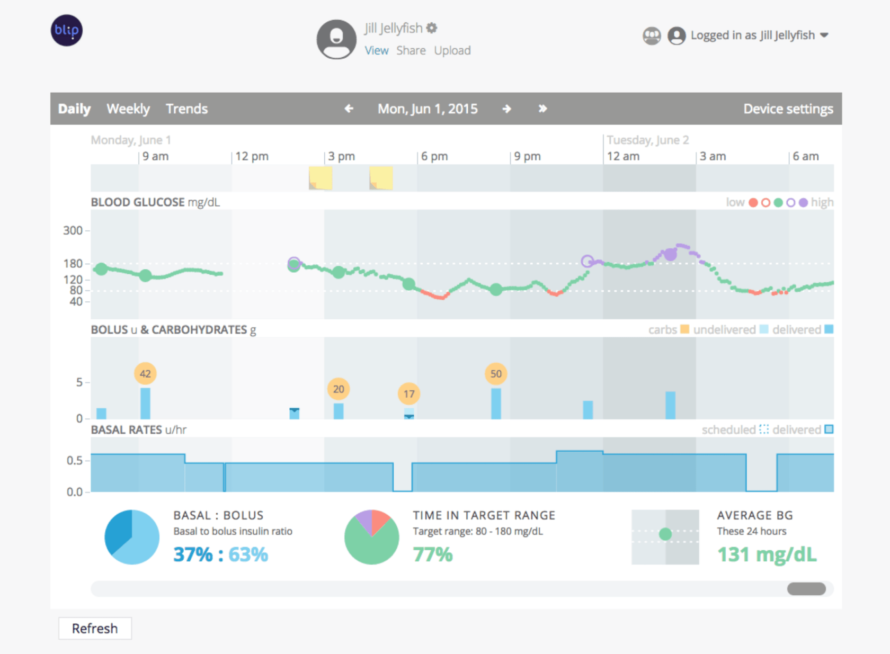
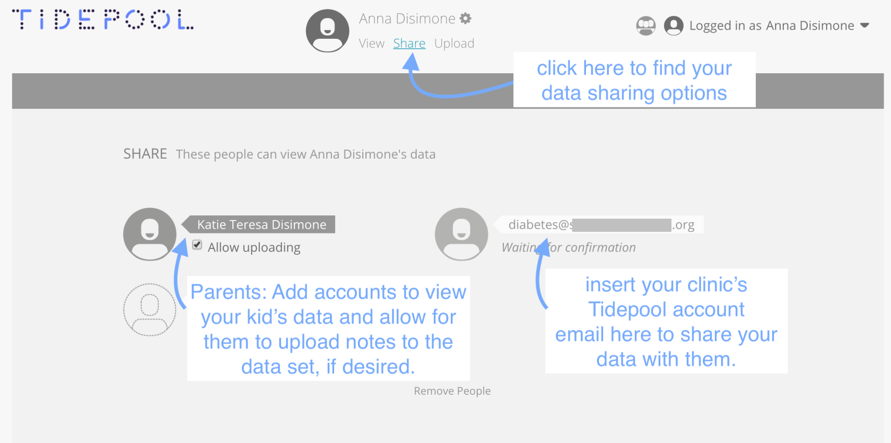
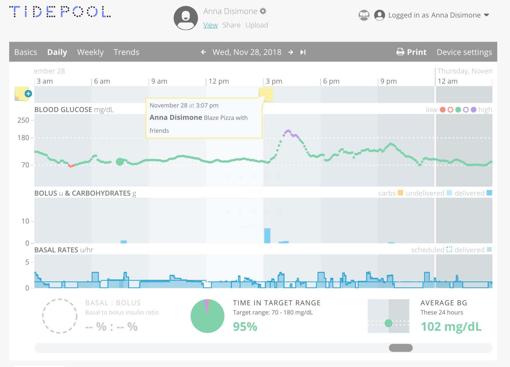
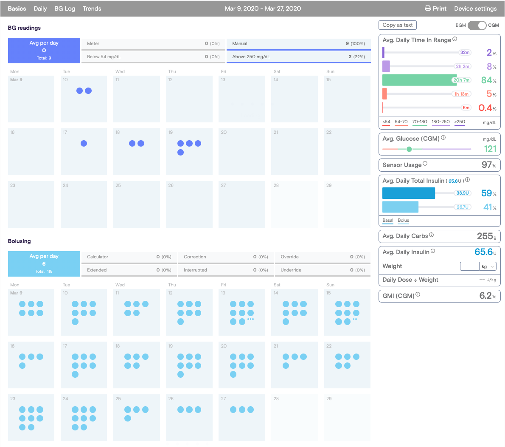
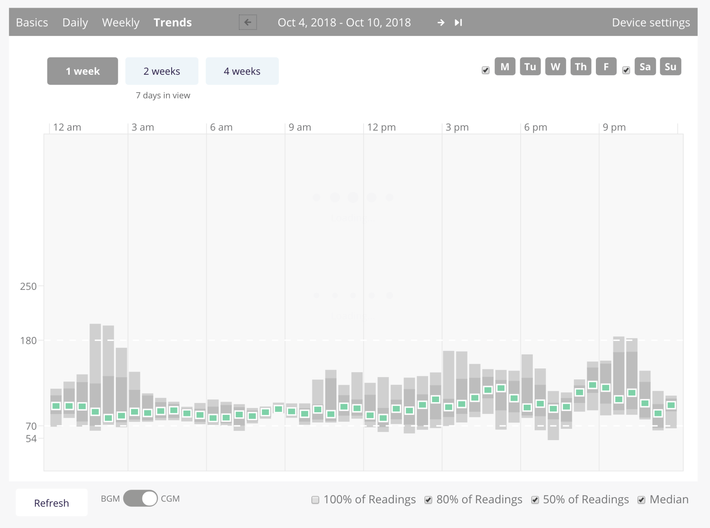
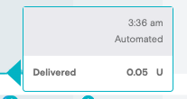
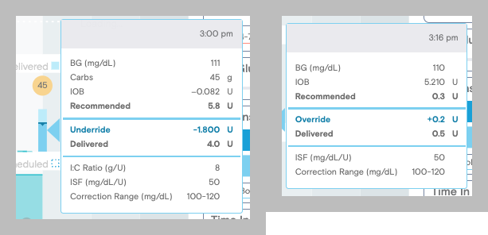
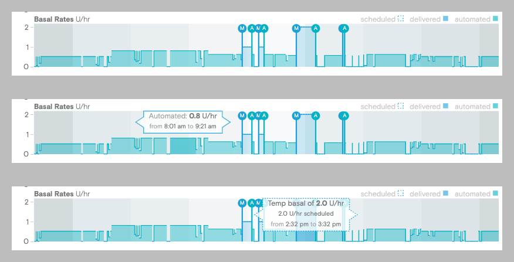
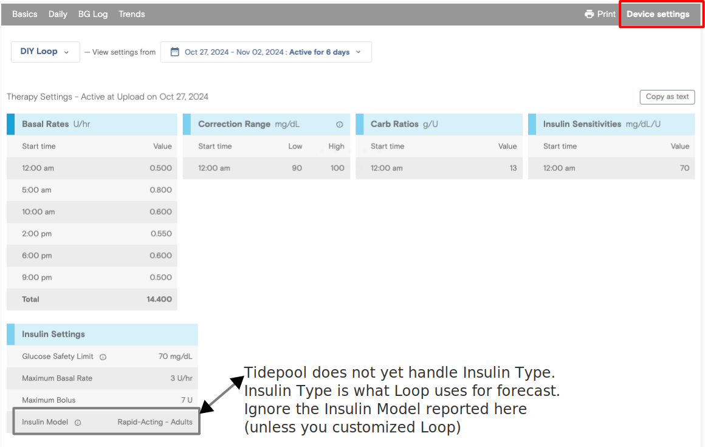
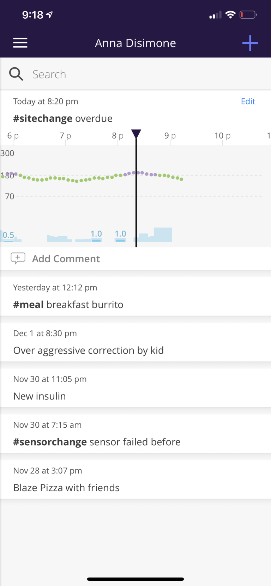

# Tidepool {: translate="no" }

!!! info "Disclosure"
    The original author of this page, *Katie DiSimone* 💚, was employed by *Tidepool* when this page was initially created. She used *Tidepool* before becoming an employee. She was not prompted to say anything in particular with regards to this information; it is written based on her own evaluation of Tidepool&#39;s services.  
    Specific questions related to *Tidepool* should be directed to [support@tidepool.org](mailto:support@tidepool.org).

## Tidepool&#39;s mission
In Tidepool&#39;s own words, their commitment to diabetes data and accessibility is pretty clear:

!!! quote "&ZeroWidthSpace;"
    Tidepool&#39;s mission is to make diabetes data more accessible, actionable and meaningful for people with diabetes, their care teams and researchers.
    
    We believe that connected data leads to better decision-making. Tidepool&#39;s free software liberates data from diabetes devices, and places it in context of the real world. Tidepool is designed to help you discover insights and bring context to your diabetes management. And, to help make your data more actionable, we allow you to share your data with anyone you choose: caregivers, clinicians, endocrinologists, friends, researchers – anyone.

## Tidepool&nbsp;  Data
Once you start uploading data into your [*Tidepool* account](https://www.tidepool.org/){: target="_blank" }, you'll see some of the benefits pretty quickly. Tidepool&#39;s data presentation is easy on the eyes. Lots of calm colors, logical data layout, quick to access important information...basically a breeze to get your needed data and get on with your analysis.

{width="750"}
{align="center"}

To use Tidepool&#39;s services, the process is pretty standard:

* Create a free [*Tidepool* account](https://www.tidepool.org/){: target="_blank" } if you don't already have one
* In the *Loop* app, go to Settings, Services and tap on the + sign to add a service
    * Choose *Tidepool* and log into your  *Tidepool* account
    * As soon as you do this, *Loop* will upload the last 7 days of data to Tidepool

If both you and someone that you provide care for has diabetes, you should set up an account for each person. [Tidepool Docs](https://support.tidepool.org/hc/en-us/articles/360038567672-What-To-Do-If-You-and-Your-Child-Have-Diabetes){: target="_blank" }.

Users can also choose to share data with their endocrinology clinic. You can also choose to share your diabetes data anonymously for the support of type 1 diabetes researchers if desired.

### How do you upload data into Tidepool account?

Follow these directions to upload Automated Insulin Delivery data from *Loop* to your *Tidepool* account:

* **Tidepool Uploader**
    * There are a lot of uploaders, but we assume  you are using the *Loop* app
    * In Loop, Settings, Add Service and log into your *Tidepool* account

* **Tidepool Mobile** (app on your phone)
    * This companion app is optional but many people use it to take notes
    * *Tidepool* Mobile is available for both Android and iOS/iPhone users. *Tidepool* Mobile is a companion app to *Tidepool* that lets you add notes about meals, exercise, or anything else. You can see your CGM, pump, and meter data alongside any notes you add. Track your favorite meals and your regular exercise, and learn from what happens. These notes are uploaded to the *Tidepool* web display so you can view those same notes in either location.

!!! abstract "**Tidepool Mobile** and *Loop*"

    * Adding *Tidepool* service to Loop uploads data from your Automated Insulin Delivery system to the *Tidepool* web display
        * This initial upload includes the full 7-day history stored in the *Loop* app
    * The companion app, *Tidepool Mobile* is for adding contextual information and notes-on-the-go to make your stored data more useful
        * Be sure to [disable Apple Health access for the *Tidepool Mobile* app](https://loopkit.github.io/loopdocs/loop-3/services/#tidepool) when using the *Loop* *Tidepool* service to avoid duplicate uploads
    * If you have duplicate uploads from *Loop* and *Tidepool Mobile*, you can apply a filter to show only one on the web display

### How can I share my Tidepool data?

Sharing the data is simple. You can click on your account’s Share option and enter in the email addresses for those that you want to share with. Those people will need a *Tidepool* account. If they don’t have one currently, they will follow easy prompts for an account setup after they’ve received your share invitation. Clinics using *Tidepool* will have a *Tidepool* account email that you can add to your account, enabling the clinic to easily view your data. You can also remove access for anyone with a simple click.

{width="550"}
{align="center"}

## View your Tidepool data

There are two distinct viewing options for your *Tidepool* data, and they are not identical. You can use both view your data:

1. Using a [desktop computer](#view-your-loop-data-using-tidepool-browser) using the Chrome or Edge browser and logging into your *Tidepool* account, or
2. Using your [*Tidepool* Mobile app **AND** associated notes](#view-your-loop-data-using-tidepool-mobile-app).

    !!! info "Supported Desktop Browser"
        Currently, only the Chrome or Edge desktop browser is compatible with *Tidepool*. You will not be able to use Safari or other browsers to view the data, nor will you be able to use the Chrome application on a phone. If you want to see your data on a computer, you need to use the Chrome or Edge browser. 

    !!! info "View Data on your Phone"
        If you want to see your data on your phone, you must use the *Tidepool* Mobile app **<i>and</i>** use an associated note to view the data surrounding the note's time frame. Mobile data viewing is not a live stream, but rather available as "bookmarked" time periods anchored by notes.

## View your *Loop* data using *Tidepool* Browser?

You will see your Loop&#39;s temporary basals, CGM readings, boluses, notes, carbohydrates, and various metrics about your data distribution. If you separately load your blood glucose meter or any other supported device to *Tidepool*, those will also overlay. You can choose to upload some CGM data from the *Loop* app. There is a feature in *Loop* for a given CGM to enable *Upload Readings*. This feature is disabled by default.

{width="750"}
{align="center"}

{width="750"}
{align="center"}

{width="750"}
{align="center"}

### Updates to *Tidepool* Browser

!!! tips "*Tidepool* Updates"
    The *Tidepool* browser has some recent (2024) enhancements.
    
    These require you to use the *Loop* *Tidepool* service uploader to have access to this information

### View Manual and Automated Details

If you hover over an item on the *Tidepool* web display, information is revealed indicating

* automatic (the word Automated is included) or manual (no notation) entry

    

* details about a manual bolus:
    * the recommended value with notation if this recommendation was modified (override or underride)
    * if this was a meal entry: Carbs and IC (insulin to carb ratio, called CR in Loop) are shown
    * in all manual bolus, the Glucose, IOB, ISF and correction target range are shown
    * in the graphic below, the left image is from meal entry and the right from a bolus added after the meal

    

* information about manual or automatic temp basal (TB) rates
    * the graphic below shows 3 views of a full day of basal rates
        * top is without hovering
        * middle: cursor hovers over an automatic TB
        * bottom hovers over a manual TB

    

## View your Therapy History

Tap on the Device Settings icon to see your historical therapy settings. You can select your history (after March 2023) by date when you use the *Tidepool Service* uploader associated wtih *Loop* version 3 or later. If you tap on *Copy as Text*, you can paste a nice version into a document.

## View your *Loop* data using *Tidepool Mobile* app?

!!! info " "
    The *Tidepool* Mobile app is not a live-viewing app for looping data. For people coming from *Nightscout*, this may be a bit confusing but realize the intended purpose of the *Tidepool* Mobile app isn’t live-viewing. It is the place where you can (1) upload/sync *HealthKit* data, (2) easily add/edit/delete notes to the data set, and (3) search for notes and view *Loop* data surrounding that note.

**In fact, you will basically see NO data in the Tidepool Mobile app unless you have Tidepool data uploaded <u>and</u> notes are added.** Once you add a note, you are basically placing a bookmark on the data set. You will be able to click on the note and see 7 hours of old data before the note, and then the note will continue to collect 7 hours of data to display after the note. So, technically, you’ll be able to refresh the app’s view to see current data for approximately 7 hours after a note is placed.

For example, here’s a sample note+data set below from my *Tidepool* Mobile app.  Over the last couple of hours, my daughter noticed that she was staying above target (unusual for her on *Loop* with the meal she had) for quite a while. She had given a couple of small corrections (see the two 1-unit correction boluses?) without result. She started her secondary troubleshooting…if it’s not the food, maybe it’s the infusion site? She realized it has been 4.5 days since changing her site. She changed the site and logged a note using the *Tidepool* Mobile app. That note appears in the *Tidepool Mobile* application, on my phone. It also shows up on her Tidepool&#39;s data, for her endocrinologist to see too, and we can refresh the view to see how blood glucose trends for the next 7 hours after the site change.

{width="250"}
{align="center"}

### What cool thing can you use this Tidepool Mobile app for?
You mean, what OTHER cool thing can the *Tidepool* Mobile application do besides automatically uploading the data from *Loop*? Tidepool Mobile also provides an easily searchable log of meal boluses. If you are still learning new meals in Loop…how much to bolus, how long of a carb absorption…these notes are searchable and super easy to add. Learning how to bolus for that Tofu Breakfast Burrito? Simply record a note of how you bolused for it. If you want to, come back afterwards and leave yourself some suggestions for the next time to try. This searchable information can also help teens learn and exercise independent skills. If they aren’t sure of how to bolus for a meal, this could give them easy tips from past success without necessarily having to stop and ask a parent. As much as a parent might scoff at the idea of a kid looking up a meal, if the alternative is asking a parent…that might be all the motivation it takes. How about co-parenting? Want to leave a note that another parent or caregiver can look up? *"How were the last Chicken McNuggets bolused?"* or *"When was the last site change?"* can easily be tracked and retrieved with notes.

For an easy example, search for the word burrito (doesn’t have to be a hashtag), and any notes with the word “burrito” will be available for review, as well as any added comments.

{width="450"}
{align="center"}

Hormones can also be easily tracked with notes. *What day-of-the-month and how did I change the basals?* Looking to find patterns in those female hormones? This could be a really slick tracking tool to easily log periods of insulin resistance and what part of the cycle they are occurring at.

### Is the Tidepool Mobile app only for Loop users?
The *Tidepool Mobile* application uploads diabetes-related HealthKit data regardless of the source. Loop users store their data in HealthKit, so this is a nice fit. Other diabetes devices (e.g., OneDrop BG meter) and apps (e.g., Spike and Dexcom) also store their data in HealthKit. Some people even manually enter their diabetes data into HealthKit. For all those uses, the *Tidepool Mobile* application will upload the HealthKit data. OpenAPS does not store its data in HealthKit, so this will not upload OpenAPS-related data. However, if OpenAPS users are using Spike app, some integration of information through Nightscout is possible. Currently, OpenAPS SMBs, boluses, and carbohydrates can be uploaded to HealthKit for OpenAPS+Spike+Nightscout+iPhone users.  Spike does plan to add temporary basal integration to HealthKit at some time in the future.

### How can you get the Tidepool Mobile app?
*Tidepool Mobile* is available in the [iOS App Store](https://apps.apple.com/us/app/tidepool-mobile/id1026395200){: target="_blank" } on your Loop device.
