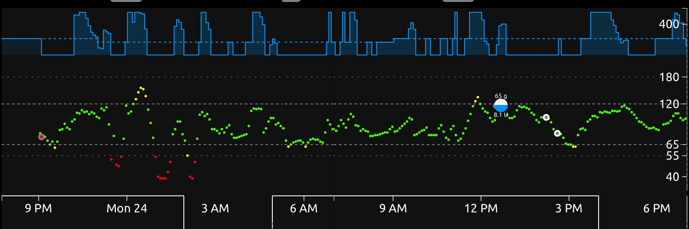
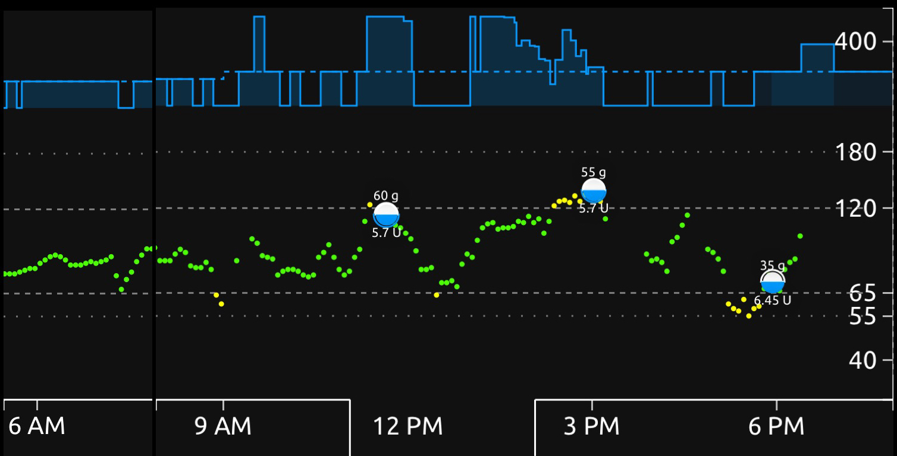

# CGM data

Obviously, without CGM data your Loop will not function. With the stability that Looping brings, many people are looking for ways to minimize their Loop downtime due to avoidable factors. Factors that make CGMs a potential problem include sensor failure, transmitter signal loss, poor calibrations, and the warmup period.

## Sensor warmup
One of the obvious downtimes is during new sensor warmup. Unfortunately, the only way to avoid the 2 hour warmup (in the case of Dexcom's system) is to overlap your sensor sessions and this just isn't feasible for most people.

* Insurance doesn't provide adequate supplies to overlap sensor supplies; you would need two active transmitters and enough sensors to allow for overlap of use.
* Sometimes sensors fail before a session was due to expire, making a planned overlap impossible.
* Some people just don't want to wear two sensors at once. 

Since warmups are an important part of stabilizing CGM values and decreasing sensor noise, they are just going to continue to be a no-Loop time period for the foreseeable future. Most people simply cancel a currently running temporary basal, or let it run its course, when they start a new sensor session. For the two hours of warmup, the Loop will revert to the basal schedule programed into the pump.

Some people have opted to keep looping during sensor warmups by manually entering blood glusose checks into the Apple Health app for Loop to read. While technically Loop can use those values, the entries would have to be sufficiently frequent to be meaningful. If a person is willing to test 8-12 times in a two hour span, then looping through sensor warmup could be feasible through this method.

## Sensor noise
Depending on which CGM device you use, you may observe a sweet spot of data accuracy in the middle of your sensor's session but have sensor "noise" at the beginning and end of the session. Generally speaking, Loop does fairly well despite these times of sensor noise, although having a reasonable maximum basal rate does help mitigate the risk due to a noisy sensor.

The figure below shows an example of a new G6 sensor for approximately its first 21 hours of use.

As you can see on the left, the red dot was a finger stick blood glucose check and it nicely aligned with the CGM value when the session first started to provide live data.  However, between that first value and approximately noon the next day, there was a considerable amount of jumpiness to the data (as well as some suspected compression lows or extreme sensor jumpiness in the first 6 hours). The CGM noise immediately decreased after the first calibration was provided at the noon-time meal bolus. (Personally, we give the G6 one calibration point about 8-12 hours after a session starts because we have noticed that it helps settle down the noise quickly. This is not a part of the standard Dexcom protocols.)

We similarly see an increase in sensor noise at the end of a sensors useful life. The figure below is a G6 sensor at 9.5 days. 

There is a marked increase in sensor noise and scatter, as well as several periods of sensor error that lead to lost CGM data. We opted to pull this sensor just shy of the 10 days due to this noise. However, as you can see, the Loop was still doing an aequate job controling overall blood glucose fluctuations despite the erratic CGM data.

## Compression lows
A frequent question from people before starting Loop is "*How does Loop deal with compression lows?*"  If you aren't familiar with compression lows, they are false low blood glucose alarms caused by sustained pressure on the sensor area. In effect, the phenomenom is much like resting on an arm for too long and causing it to fall asleep from poor blood flow.

The figure above showing the new sensor noise shows a couple of examples of compression lows. Generally speaking, Loop will deal with compression lows just fine.  Loop will suspend for a short time during the low blood glucose values, and then recover with temporary high temporary basals to make up for the active insulin it had missed as result of the compression low. No special actions need to be taken for compression lows.

## Calibration jumps
It is also worth noting that Loop will not calculate blood glucose momentum in instances where CGM data is not continuous (i.e., must have at least three continuous CGM readings to draw the best-fit straight line trend). It also will not calculate blood glucose momentum when the last three CGM readings contain any calibration points, as those may not be representative of true blood glucose momentum trends. Therefore, calibration jumps or missing data will not adversely affect the insulin dosing based on blood glucose momentum.

## Loss of CGM data
Transmitter failure, sensor failure, or other equipment failures can lead to a failure in CGM data. In those cases, Loop will revert back to the pump settings after any currently running temporary basal finishes or is manually canceled by the user.
