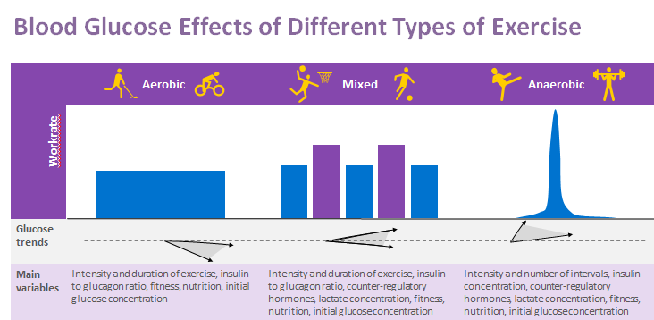

# Exercise

Hands-down, exercise is the most commonly discussed topic of long-term Loop users. Exercise is highly specific to an individual and its impact on blood sugar is not always equal. For example, many people find anaerobic exercise such as weight lifting will raise blood glucose, and aerobic exercise such as running will lower blood glucose. The degree to which impacts are observed also depends on the insulin and carbohydrates on board going into the exercise. Blood glucose response in competition can be quite different than a regular training session due to the added adrenaline. Exercising with T1D does require extra preparation, but with preparation, things should go much easier.

## Exercise Basics
A 2013 JDRF survey found that 36 percent of T1D patients, caregivers and healthcare professionals view exercise as a challenge and would like to learn more about exercising safely. The JDRF PEAK (T!D Performance in Exercise and Knowledge) education curriculum explores the environmental, dietary, physiological and psychosocial elements that impact physical activity with T1D ([source](https://www.jdrf.org/t1d-resources/peak/){: target="_blank" }). As part of JDRF's PEAK resources, they have published a helpful [article about exercise and T1D for athletes](https://www.jdrf.org/t1d-resources/living-with-t1d/exercise/){: target="_blank" }. Below is an excerpt from that article.  There are a couple key considerations (highlighted in orange) that be different in Loop use.  Those considerations are discussed further below.

***********************
**With great exercise, comes great responsibility**

It goes both ways: exercise affects glucose control; glucose control affects exercise. Consistent physical activity produces consistent insulin sensitivity, which helps the body process glucose more evenly (avoid spikes), maybe even improving HbA1c.  

Some considerations:

* Risk for hypoglycemia can be reduced by avoiding too much insulin on board (IOB) during and after exercise.
* Continuous glucose monitors (CGMs) or regular blood glucose testing provides critical information to preemptively minimize blood-sugar highs and lows.
* Plan ahead! Reduce insulin and add carbs for aerobic (longer duration, lower intensity) exercise, which causes blood sugar to drop, or increase for anaerobic (short duration, high intensity), which may cause spikes.
* After most exercise, insulin sensitivity is higher for 24 hours. Carbohydrates needed to replace liver glycogen levels must be balanced with decreased insulin levels.

**Intensity. Speed. Environment. Duration… all affect the body’s reaction**

There are three types of exercise:

* Aerobic
    * Aerobic exercise is usually continuous, light-to moderate intensity exercise and includes activities like running, walking, long-distance swimming, biking or tennis. Aerobic exercise typically tends to lower blood glucose levels.
* Anaerobic
    * Anaerobic exercise is generally shorter in duration, of maximal to super max intensity and includes activities like sprinting, gymnastic, ice hockey, or weight training. Anaerobic exercise typically tends to raise blood glucose levels.
* Mixed
    * Mixed exercise is combination of the aerobic and anaerobic activity such as basketball or soccer. Managing blood glucose levels with mixed exercise is difficult, but using a tool like a continuous glucose monitor can help greatly.

{width="750"}
{align="center"}

Glucose levels during sports affect performance in many ways: strength, stamina, speed, agility, flexibility, safety and mental sharpness.

* Insulin resistance, which is when the body requires more insulin to process glucose, is a problem. Exercise combats this by increasing insulin sensitivity and glucose uptake by muscles. Muscles are better able to absorb glucose when contracted.
* Exercise thwarts postprandial (after-meal) hyperglycemia by slowing carbohydrate absorption, increasing glucose utilization and accelerating insulin action.
* Practice vs game day – each can have dramatically different effects on your T1D.  Adrenaline and stress both raise blood glucose levels and are typically present on the day of your game or event. 

**Balancing Act: Finding your blood glucose zone and peak fitness zone**

Caution: Delayed Onset Hypoglycemia can occur 6 to 12 hours (sometimes 24 hours) after exhaustive exercise, due to replenishment of muscle glycogen stores and enhanced insulin sensitivity. It is possible to prevent this by:

* keeping records of your fitness regimen and the effects it has on your body
* using a CGM or frequent blood testing to monitor your body’s response to activity
* decreasing basal insulin or meal boluses after activity
* consuming slow-acting carbohydrates after activity

Similar recording and monitoring tactics can be used to prevent hyperglycemia (blood-sugar highs). Some other options include:

* bolusing (at a half dose) 30 to 60 minutes prior to activity to offset rise of blood glucose, delayed bolusing or adding post-workout cool-down (depending on conditions of rise) 
* incorporating relaxation, breathing, visualization tools to address pre-workout emotional stress
* limiting pump disconnection time
* hydrating
* administering rapid-acting insulin (only under certain conditions)

## Loop Considerations
With all of that background laid out, your Loop can help with some of the techniques described above. Highlighted in orange above are parts of those recommendations and considerations that we should explore a little more for Loop in particular:

Risk for hypoglycemia can be reduced by avoiding too much insulin on board (IOB) during and after exercise. -- In Loop use, we can accomplish this through setting a workout target far enough ahead of the exercise to help decrease basal insulin on board going into exercise. Typically this means setting a workout target at least 1, if not 2, hours prior to exercise. Setting a workout target just as you begin a workout will not allow sufficient time to decrease IOB ahead of an aerobic workout. Loop workout targets are usually 50 mg/dL higher than your usual correction target, although that is a guide. Practice and observation of your typical exercise needs will help refine your optimal settings. And while not Loop specific, minimize heavy carb meals in the 3 hours before intense exercise that would require large boluses. If eating during that time, consider partial boluses and slower, lower carbohydrate snacks. If bolusing while workout targets are enacted, Loop will automatically recommend a smaller bolus than you would get with your normal correction target.

After most exercise, insulin sensitivity is higher for up to 24 hours. Carbohydrates needed to replace liver glycogen levels must be balanced with decreased insulin levels.-- For Loop use, this period of increased insulin sensitivity may require continuing or setting a workout target for some period of time after exercise is finished. This will help manage increased sensitivity by providing smaller boluses and less basal delivery to prevent hypoglycemia that could result from unadjusted settings under traditional therapy. The length of time to run a continued post-workout target will depend on the duration and intensity of exercise.
