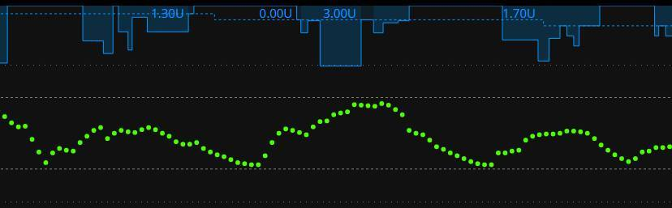
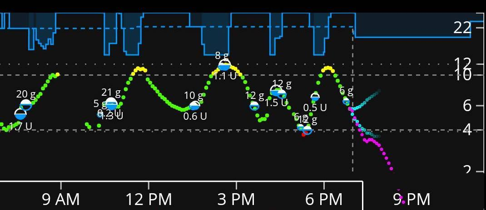
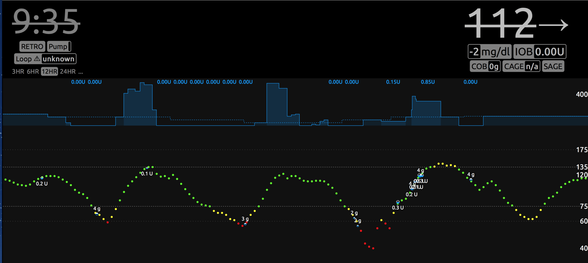

# Low Treatments

Low blood glucose will still inevitably happen at some point, even with OS-AID use. A difficult carb count, illness, equipment malfunction, exercise...you name it, eventually something will help to cause a low glucose. 

## How to Treat

Overall, most people find that they can treat low glucose with **fewer rescue carbohydrates** than they needed before using a hybrid-closed loop system. Typically your OS-AID suspends your basal insulin before a low has been reached; consequently, you have less insulin on board (IOB) to overcome with carbohydrates. In other words, your OS-AID takes some of the momentum out of an upcoming glucose dip...which also makes it easier to pull up from declining glucose.

If you notice that your old way of treating low glucose is leading to rebound glucose greater than you expect/desire, eventually consider decreasing the amount of carbohydrates you use to treat predicted/upcoming low glucose.

!!! tip "Why Loop Prevents Deeper Lows"
    As explained in [Think Like a Loop](think-like-loop.md), Loop suspends insulin delivery (Action 1) when ANY part of your predicted glucose curve goes below your suspend threshold. This early suspension is why you typically need fewer carbs to treat lows with Loop.

## Logging Low Treatments

Another common question for new OS-AID users is whether to enter the carbohydrates used to treat a low blood sugar. There is not one answer on how to deal with low treatment entries: logging your rescue carbs is just as acceptable as leaving them out. The decision often depends on factors that vary by the situation.

For example, some people use OpenAPS's autotune (which needs all carbohydrate inputs to do a better estimation), others desire to have more thorough clinical records, some are caregivers sharing responsibility so must know what treatments were given.

For the most part, you do not *have* to enter low treatments. Not logging low treatments will work out pretty well if you are not overtreating the low and you have your ISF pretty well determined.

> In the event you overtreat lows and your ISF value is too low a number (too strong), your OS-AID may be more likely to overtreat rebound situations.

To help you decide, here are some pros and cons of each approach.

**Reasons to enter rescue carbs**

* Since Loop "sees" the incoming carbs, it can recommend a dose right on the carb-entry screen to cover an over-treatment of the low, which helps blunt the rebound roller coaster. Without the entry, Loop tends to dose that rise as a correction later on - which can itself trigger a roller coaster, especially with automatic bolus enabled.
* Your reports, graphs, and clinical records stay complete, so you and your care team can see exactly how a low was treated.
* Tools that rely on a full carbohydrate history - such as OpenAPS autotune - can tune your settings more accurately.
* It keeps your logging habit consistent, so you are less likely to forget to enter "real" meals.

**Reasons not to enter rescue carbs**

* It is less effort in the moment - when you are low, treating quickly matters more than logging. Because Loop usually suspends insulin before a low is reached, you often need only a small amount of fast carbs, and a small untracked treatment has limited impact when your ISF is well tuned.
* You will normally treat the low with fast-acting carbs first and log it afterward, so your glucose may already be rebounding by the time you open Loop. The entry then has to be **backdated** to when you actually ate; if you forget to backdate, Loop assumes the carbs were just eaten and will over-predict the coming rise, and can recommend or deliver too much insulin - setting off the very rebound you were trying to avoid.

One rule of thumb: if you know you over-treated a low, log the "extra" you consumed - even if you don't normally log small rescue carbs.

!!! note "Retrospective Correction makes this matter more"
    Loop's [*Retrospective Correction* (RC)](think-like-loop.md) - on by default, with a more aggressive [*Integral Retrospective Correction* (IRC)](https://loopkit.github.io/loopdocs/loop-3/features/#integral-retrospective-correction-irc) available as an opt-in under the Algorithm Experiment section of Loop settings - steers the forecast using the gap between what Loop predicted and what your glucose actually did. A rescue treatment you don't enter (or enter with the wrong time) leaves the resulting rise looking like an *unexplained* climb, which pushes that correction toward **more** insulin and can deepen the rebound.

## Roller Coaster after Low Treatment

If you are roller coastering glucose after treating lows (going low, quick rise from the treatment carbs, then drop again from the insulin Loop doses to correct that rise - whether high temporary basals or an automatic bolus - and then repeating pattern), here are some tips that can help regardless of whether you entered the treatment or not:

1. **While treating the low glucose**, try setting a temporary [override target](overrides.md){: target="_blank"} higher than your normal target for an hour to help keep Loop from aggressively treating a rebound.

2. **Consider adjusting insulin needs in your override.** When changing the insulin needs you are decreasing the effective scheduled basal rate and increasing (making weaker) the insulin sensitivity factor and carb ratio. See [Adjust Insulin Needs](overrides.md#adjust-insulin-needs){: target="_blank"}.

If your ISF is set to a value that is too low compared to what it really should be, one of the most common symptoms you'll see is a roller coaster of blood glucose where the temporary basals are cycling between zero and strong high temporary rates or automatic boluses. Here are some example graphs from *Looped* group. These are examples where too low of ISF is more than likely a large factor in the roller coaster (doesn't mean it is the only culprit and is more difficult to ferret out when food is involved like the second graph).  But, lightning bolt high temporary basals followed by very quick blood glucose drops and zero temps is usually too low of ISF value...raise the ISF value (e.g., go from 50 to 55) to help Loop know that each unit of insulin is actually having more impact than you'd previously thought.

{width="650"}

{width="650"}

{width="650"}

