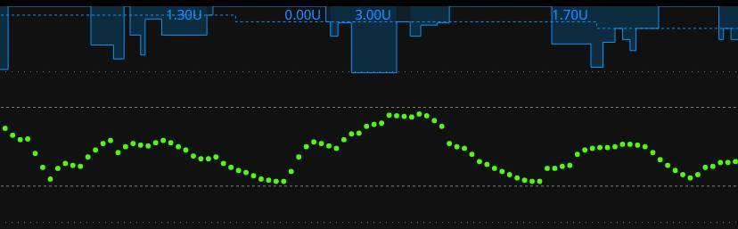

# Initial Settings

Here's how 90% of Loopers start:

1. Switch from their existing pump over to a Loop-compatible pump
2. Within hours, they begin closed loop use of Loop
3. When blood glucose isn't as smooth as hoped for, Looper begins to try to adjust settings while still in closed loop

The problem with this sequence is that adjusting settings on the fly while in closed loop can be difficult as a new user. As you become more experienced there are some great tips for adjusting settings while in closed loop, like [*Loop and Learn: Basal Testing in Closed Loop*](https://www.loopandlearn.org/basal-testing-in-closed-loop/){: target="_blank" }, but as a new Looper, you should start with the basics. Here are some recommendations to help make the transition to closed loop easier.  The first place to start is with getting the best initial settings as you can.

## Try Open Looping first

If I could offer one bit of really useful advice, it would be to open loop for at least a few days. Adjust to the user interface and buttons you'll be pressing.  This breaking-in phase will also let you get used to a new pump if you've never used Omnipod before or if you are new to using a Medtronic pump.  If there are differences between how your body absorbs insulin from your old pump vs the new pump, open looping will be a good way to notice those before adding the complexity of automated corrections from Loop.

!!! warning "Open Loop is like Manual Pump"
    While **open looping** and entering meals with the pizza icon, Loop will recommend less upfront bolus with the intent to make up the remainder of needed insulin via automated dosing later. In those situations, you may have to manually dose the split portion of the bolus later, similar to normal pump use for slow digesting meals like pizza and quesadillas, since Loop will not be automatically dosing.

If you want extra help, you can read some excellent books about pump settings and what they mean.  For example, "*Think Like a Pancreas*" by Gary Scheiner is a great reference for understanding some of the guiding principles in pump therapy.  Let me summarize the important parts about pump settings:

* **Basal rates** should keep your glucose steady in the absence of other influences (such as food, medications, etc).
* **Boluses** should return your glucose to target after a meal.
* **Insulin Sensitivity Factor (ISF)** is the amount one unit of insulin drops your glucose without other influences.
* **Carb Ratio (CR)** is the meal entry in grams that requires one unit of insulin to cover

See [Why Settings Matter](overview.md) for more on how Loop uses these settings.

!!! tip "Basal, ISF and CR"
    It's the way it was defined in the beginning, but it can be confusing.

    If you need more insulin

    * Basal rates should increase (higher number)
    * ISF and CR should be stronger (lower number)
        * They are in the denominator of the fraction

It is absolutely possible to have two wrong settings look like right settings when they balance out. The problem is that those wrong settings won't balance out in all situations...and Looping will not be smooth in those situations. Remember - in closed loop mode, Loop will adjust with every new glucose reading - typically every 5 minutes. What worked on a manual pump when adjusting infrequently, might not be suitable for Loop.

Example:

* Too low a value for basal rates can be offset by regular eating of meals with too strong (lower value) carb ratio
* If you stop eating though, you'll start going high because that extra insulin from the meal boluses won't be there to offset the lack in basal rates

Taking the time to validate your settings by truly testing them is really good practice before closing loop.

### Insulin Duration

The majority of pumpers used DIA at about 3 hours on traditional pump therapy. There's a reason for that.  In traditional pumps, a simple linear model is used to estimate the decay in effectiveness of the insulin already delivered. And it is true that after 3 or 4 hours, insulin is not affecting glucose as much as initially. But the true biological lifetime of insulin has a long tail. Insulin from more than 5 hours ago is still making a small decrease in your glucose. Loop takes that into account using a realistic model for insulin effectiveness.

In your traditional pump, the DIA, using a linear model, was used to give a correction because blood glucose is stuck high or going low...in other words, DIA was used as a rough approximation to correct off-target blood glucose. It doesn't have to be rocket science then since we're making an approximation because some other numbers (carbohydrate count, basal rates, ISF, etc) weren't behaving the way we were expecting either and therefore leading to an off-target blood glucose.

With the release of Loop 3, all insulin types use a realistic model, so you will not be selecting a DIA. These models help prevent insulin stacking as you begin Loop. You can read more about insulin models and how they help determine the active insulin over time in the [LoopDocs: Algorithm](https://loopkit.github.io/loopdocs/operation/algorithm/overview){: target="_blank" } pages.

With Loop 3, you will select the Insulin Type you use, such as Novalog, Humalog, Apidra, Fiasp or Lyumjev. Each is associated with the appropriate exponential model for onset and peak action times.

### Basal Rates

Basal rates are the keystone of your therapy settings. Establishing a quality basal schedule is setting yourself up for successful looping. Personally, we find testing basal rates can be pretty painless and doesn't require days of fasting. Instead, look for easy opportunities. If you are willing to open-loop test, that is going to give the most accurate information in the quickest way.

It's a pretty easy test. Turn off your loop or open loop. Don't eat food, don't do crazy exercise, don't sit in a hot tub. Just have a relaxing average time period and see if your basal rates are able to hold you roughly steady. It doesn't matter if you are at target or not; the idea is to simply have zero extra active insulin from any boluses or corrections and watch what happens during those hours. Typically you would want to see about 3-4 hours of blood glucose without the influence of food boluses or activity. You can even try this tip: [Loop and Learn: Basal Testing in Closed Loop](https://www.loopandlearn.org/basal-testing-in-closed-loop/){: target="_blank" }

Many people, especially little kids, are not enthusiastic about fasting basal testing...so look for opportunities to make it less cumbersome if you have to eat during the test. For example, use a low carb meal/snack that you know how to bolus for (or doesn't need a bolus at all) and generally needs no corrections. For us, that's two extra large scrambled eggs (or three small ones) with cheese bolused at 8g. If she eats that meal, the blood glucose response is slow and measured. Three hours after that meal, the bolus and food effects are really muted and we can start watching to see if blood glucose stayed pretty steady.  For example, here's some of a recent open-loop basal testing we did and confirmed that blood glucose could stay pretty steady without the involvement of temporary basal help from looping.

{width="650"}

### Insulin Sensitivity Factor

Insulin sensitivity factor (ISF) is the next logical setting to test. If you've just done the basal test and gotten steady blood glucose with an open loop, try taking a glucose tab or two. Wait for your blood glucose to be steady at the higher value, and give a safe correction that you think will get you close to target. Watch the resulting blood glucose drop over the next 3-4 hours. You should see blood glucose come to a steady level again. How much did the blood glucose drop? How many units of insulin did you use? Divide the two numbers and you will have your ISF.  If your glucose dropped 15 mg/dL with half a unit of insulin, your ISF is approximately 30 mg/dL per unit.

Testing ISF is an important step in successful closed Loop use. ISF is used in every Loop calculation and plays an important part in Loop's prediction curve. Most users find that they have to adjust ISF; most often increasing the value. If you are experiencing roller coastering blood glucose, as described below, that is often a sign that ISF needs to be weaker (higher value).

Before you read the next part, let's clear up some definitions and terms:

Insulin sensitivity factor described just that...how sensitive your blood glucose is to the effect of insulin. If your blood glucose doesn't drop much when you put in insulin and you have to use a lot, your insulin sensitivity is "weak". If your blood glucose drops quickly and you don't need much insulin to correct a high blood glucose, your insulin sensitivity is "strong".

The terminology gets confusing sometimes because some people think of the terms "weak" and "strong" in terms of how Loop's actions will behave.  If you make your ISF value greater (i.e., changing it from 50 to 55), you are *weakening* the magnitude of Loop's adjustments because you are telling Loop that your sensitivity to insulin is *stronger*...you don't need as much to correct a high blood glucose and suspensions will have a tendency to rebound more.

In order to avoid the confusion that surrounds the words "weak" and "strong", instead we will describe the actual adjustment to the ISF ***value***...the number itself.

If your ISF is set to a value that is too low compared to what it really should be, one of the most common symptoms you'll see is a roller coaster of blood glucose where the insulin adjustments are cycling between zero basal and strong high temporary rates (or automatic boluses). Here are some example graphs from Looped group. These are examples where too low of ISF is more than likely a large factor in the roller coaster (doesn't mean it is the only culprit, and is more difficult to ferret out when food is involved like the second graph). Lightning bolt high temporary basals followed by very quick blood glucose drops and zero temps is usually too low of ISF value...raise the ISF value (e.g., go from 50 to 55) to help Loop know that each unit of insulin is actually having more impact than you'd previously thought. Making changes of about 10% for a setting is reasonable to try; just make sure you are changing it in the correct direction - remember: a lower number = more insulin; a higher number = less insulin.

{width="650"}

{width="650"}

{width="650"}

### Carb Ratios

Now that you have basals and ISF set, here's where it gets really tempting to close loop and move on. And, truthfully, it's not that hard to test carb ratios on a closed loop vs an open loop if you've solidly tested all these other factors.

A good carb ratio will bring your blood glucose, for an average meal, back to the starting point of the meal within about 3 hours or so.

A bad carb ratio will leave you higher or lower than the starting point of the meal.

For example, this graph shows too aggressive of a carb ratio (value too low).  Three hours after the meal, there's nearly 0.50 units of active insulin, blood glucose is well below where the meal started, and definitely low treatments needed.

{width="350"}

If you are finding that a correct carb ratio is yielding good blood glucose 3 hours later, but you aren't happy with the peak blood glucose during the meal, then it may be time to explore increasing or adding prebolusing time to your meal or implementing "eating soon" targets an hour before meals to help control the post-meal blood glucose spike. Artificially strengthening carb ratios to help control post-meal blood glucose spike will likely yield lows 2-3 hours after a meal.
